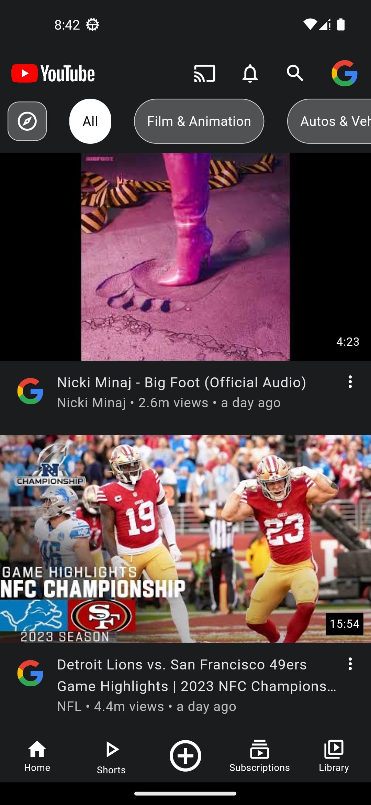
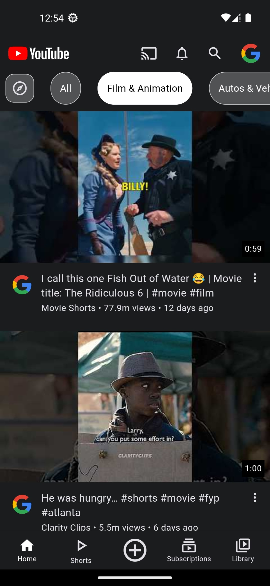
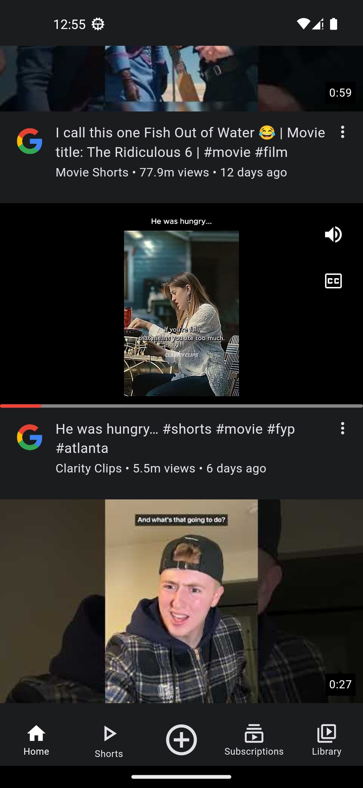
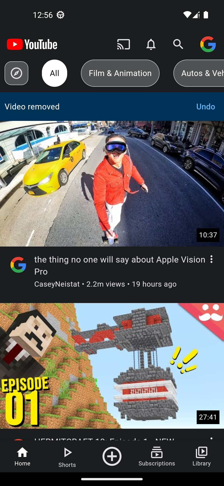
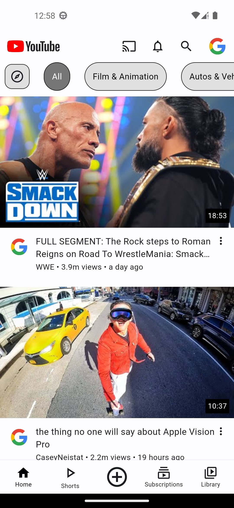

# Youtube clone

This project is aimed at cloning most of functionality of the original youtube app. My goal is to apply skills for creating an app with different features. (that tackle different aspects of programming)

## Current features:
* load popular videos (for now, in the future, it'll be based on user's authentication status and videos will be either popular or liked) + view different categories
* view videos with in-line player (on home and search screens) + un/mute them
* un/hide videos
* expand the miniplayer and watch the video in minimized/full screen mode and optionally, change quality
* watch a video with the ability to dis/like it (if the user is authenticated), subscribe to the channel, and view the comments
* search videos (including shorts), channels, and playlists (work in progress) + view history and suggestions for searched words
* view channels, their tabs, and subscribe to them (if authenticated)
* watch shorts (work in progress)
* switch between light and dark themes

## Features to be added:
* make authentication available for user
* add videos to playlists, including when user is not authenticated
* sign-in to account to perform authenticated actions (dis/like & subscribe)

## Screenshots

### Splash

### Home screen
<pre>
        
</pre>